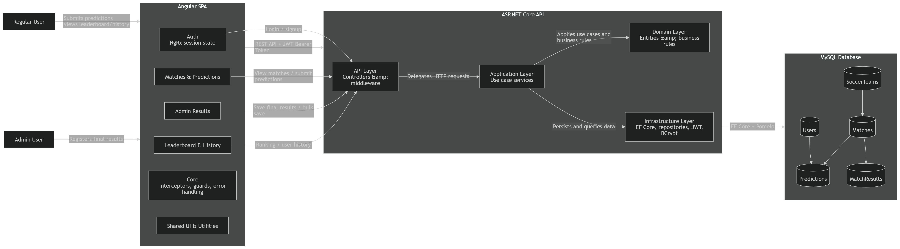

## Descripción de Arquitectura

La solución está dividida en tres bloques principales: **Frontend Angular**, **Backend ASP.NET Core** y **Base de datos MySQL**. Esta separación permite mantener responsabilidades claras, facilitar el mantenimiento y escalar cada parte de forma independiente.


---

## Frontend - Angular SPA

El frontend usa una arquitectura basada en **Features** con 2 capas transversales **Core y Shared**.

### Features

Contiene las funcionalidades principales del negocio. Cada feature agrupa sus propias páginas, componentes y servicios, reduciendo el acoplamiento entre módulos.

* `auth`

  * Login y registro de usuarios.
  * Manejo del estado de sesión.
  * Integración con NgRx para autenticación.

* `matches`

  * Visualización de partidos.
  * Gestión de predicciones del usuario.
  * Consulta de predicciones existentes.

* `admin`

  * Carga de resultados finales.
  * Actualización individual o masiva de resultados.
  * Vista operativa para usuarios con rol administrador.

* `leaderboard`

  * Ranking global de usuarios.
  * Visualización de puntos acumulados.
  * Historial de predicciones por usuario.

### Core

Centraliza responsabilidades transversales de la aplicación.

* Guards de autenticación y autorización.
* Interceptores HTTP.
* Manejo global de errores.

### Shared

Contiene elementos reutilizables entre diferentes features.

* Componentes visuales comunes.
* Modelos compartidos.
* Servicios compartidos.
* Utilidades para formateo, validaciones y manejo de resultados.

### Estado

NgRx se usa únicamente para autenticación, ya que el estado de sesión es compartido por varias partes de la aplicación, como guards, interceptores y navegación. Para las demás funcionalidades se usan servicios y estado local con RxJS, evitando complejidad innecesaria.

---

## Backend - ASP.NET Core API

El backend usa una arquitectura por capas, separando la entrada HTTP, los casos de uso, las reglas de negocio y los detalles técnicos.

### API Layer

Expone los endpoints REST consumidos por Angular. Esta capa contiene controllers, middlewares, autorización por roles y manejo estándar de respuestas. Los controllers se mantienen delgados y delegan la lógica a la capa de aplicación.

### Application Layer

Contiene los casos de uso principales del sistema:

* autenticación y registro;
* consulta de partidos;
* creación y actualización de predicciones;
* carga de resultados finales;
* consulta del leaderboard e historial.

Esta capa orquesta el flujo de la aplicación y coordina el uso de entidades de dominio e infraestructura.

### Domain Layer

Contiene las entidades principales y reglas del negocio:

* `AppUser`
* `SoccerTeam`
* `Match`
* `Prediction`
* `MatchResult`

La lógica de puntuación se mantiene en el dominio para evitar duplicarla en controllers o en el frontend:

* Marcador exacto: `3 puntos`
* Ganador o empate correcto: `1 punto`
* Predicción incorrecta: `0 puntos`

### Infrastructure Layer

Contiene los detalles técnicos de la aplicación:

* persistencia con EF Core;
* repositorios;
* configuración de entidades;
* generación de JWT;
* hashing de contraseñas con BCrypt;
* seeders iniciales;
* conexión con MySQL.

Esta capa aísla detalles técnicos para que la lógica de negocio no dependa directamente de la base de datos ni de implementaciones externas.

---

## Base de Datos - MySQL

La aplicación usa una base de datos relacional en MySQL, generada mediante un enfoque **Code First con EF Core**.

Las entidades principales persistidas son:

* `Users`
* `SoccerTeams`
* `Matches`
* `Predictions`
* `MatchResults`

El modelo define relaciones entre usuarios, partidos, equipos, predicciones y resultados. Por ejemplo, un usuario puede tener varias predicciones, un partido puede tener varias predicciones y cada partido puede tener un resultado final.

---

## Flujo Principal

Cuando un administrador guarda el resultado final de un partido:

```txt
Admin guarda resultado
  → Frontend envía la solicitud
  → API recibe la petición
  → Application Layer procesa el caso de uso
  → Domain Layer calcula los puntos de las predicciones
  → Infrastructure Layer persiste los cambios en MySQL
  → Leaderboard muestra los puntos actualizados
```

---

## Escalabilidad

La arquitectura fue definida teniendo en cuenta el alcance del proyecto: una aplicación principalmente CRUD, con reglas de negocio acotadas alrededor de predicciones, resultados y cálculo de puntos.

Por esta razón, en backend se usó una Layered Architecture, ya que permite separar responsabilidades sin agregar complejidad innecesaria. Cada capa tiene un propósito claro:

* API Layer: expone endpoints y maneja la entrada HTTP.
* Application Layer: orquesta los casos de uso.
* Domain Layer: centraliza entidades y reglas de negocio.
* Infrastructure Layer: encapsula persistencia, autenticación y detalles técnicos.

En frontend se usó una arquitectura basada en **Feature** con 2 capas transversales **Core y Shared**, lo que permite organizar la aplicación por funcionalidades de negocio. Cada feature mantiene sus propias páginas, componentes y servicios, facilitando agregar nuevas funcionalidades sin afectar el resto de la aplicación.

Esta separación permite que el sistema escale de forma ordenada a nivel de código. Por ejemplo, si en el futuro se agregan nuevas fases del torneo, nuevos rankings, más tipos de predicción o nuevas vistas administrativas, estas funcionalidades pueden incorporarse como nuevas features en Angular y nuevos servicios/casos de uso en backend.

Además, cada capa y feature mantiene una responsabilidad clara, reduciendo el acoplamiento y facilitando mantenimiento, pruebas y evolución del sistema. Para una versión productiva de mayor escala, se podrían agregar mejoras como caching para el leaderboard, jobs en background para recálculos masivos, observabilidad y rate limiting.